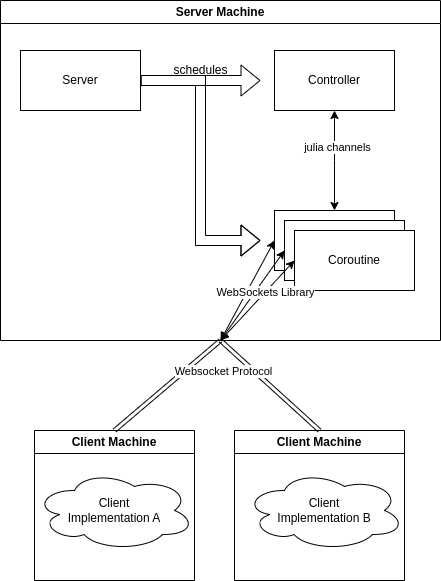

# Scheduling an Electricity Grid with Consensus ADMM

This repository contains the code solving a linear program that schedules an electricity grid while minimizing the cost. The problem is solved using consensus ADMM and can be deployed in a fully distributed manner.

## Research Goal

The goal of this research is to implement consensus ADMM for a linear program that schedules an electricity grid. The implementation should be able to run in a fully distributed manner. Each bus and line of the electricity grid is represented by a (possibly) different client. Therefore, in order to solve problem, the parties need to communicate with a central server. Optimization is only done by the clients, the server only acts as a coordinator and implements the consensus ADMM algorithm.
This research shows that such an implementation is possible and benchmarks the performance of the distributed implementation against a couple of centralized implementations.

## Repository Structure

The source code of the model is contained in the `src` folder. The data used for the model is taken from the [IEEE Power System Test Case Archive](https://labs.ece.uw.edu/pstca/) and should be placed in the `data` folder. The `results` folder contains the results of the benchmarks. The `notebooks` folder contains Jupyter Notebooks which present parts of the implementation. The `bin` folder contains a binary that can start the distributed algorithm.

| file                            | description                                                                                                                |
|---------------------------------|----------------------------------------------------------------------------------------------------------------------------|
| `./notebooks/sketch`            | contains sample implementation of Lagrangian Relaxation, Augmented Lagrangian Relaxation, Exchange ADMM and Consensus ADMM |
| `./notebooks/01_admm.ipynb`     | runs our implementation of Consensus ADMM                                                                                  |
| `./notebooks/02_benchmark.ipynb | runs different kinds (centralized/distributed) ADMM against all IEEE datasets and saves the results                        |
| `./notebooks/03_results.ipynb   | reads and presents the results                                                                                             |
| `./src/admm.jl`                 | centralized implementation of ADMM                                                                                         |
| `./src/simple_lp.jl`            | implementation of solving the electricity with a simple linear program                                                     |
| `./src/ieee_parser.jl           | parses IEEE datasets in the [IEEE Common Data Format](https://labs.ece.uw.edu/pstca/formats/cdf.txt)                       |
| `./src/distributed/*`           | distributed implementation of ADMM                                                                                         |

## Architecture of Distributed ADMM
The distributed implementation is developed in such a way that it could be used in practice.
In order to run it one central server is needed. The central server takes care of coordination. That is, informing clients about the network topology, performing the update step of the ADMM algorithm, and receiving and sending updates to clients.
It consists of two major parts: the controller and multiple coroutines. 
The controller performs the update step, checks for convergence criteria and communicates with the coroutines.
A coroutine is started when a client connects to the server and ends as soon as the client disconnects.
The coroutine sends and receives messages from the client and then communicates these messages to the controller.
Both the coroutines and the controller are scheduled by the server.   

The clients communicate with the coroutines of the server through a network.
Their task is to repeatedly solve the decomposed linear programs until convergence is reached.
The implementation of the client can vary and clients don't have to know the specifics of other clients.

In order to communicate between client and server some kind of networking protocol has to be implemented.
This research proposes Websockets as the networking solution.

## How to run

### Setup
1. Place the [data](https://labs.ece.uw.edu/pstca/) in the
   `data` folder (should contain `ieeeXXcdf.txt`).
2. Install
   [Gurobi](https://www.gurobi.com/academia/academic-program-and-licenses/) or
   change the solver in `src/admm.jl`.

### Run
The non-distributed ADMM can be run via the notebook `./notebooks/01_admm.ipynb`.
For the distributed ADMM read the instructions below.

### Entrypoints of Distributed ADMM
The main entry for the client and the server are the files `./client_main.jl` and `./server_main.jl`, respectively.
The server can be started with `julia ./server_main.jl <path>`, where path is the path to the IEEE datafile, that should be used for the network.
One client can be started with `julia ./server_main.jl <id>`, where ID is the ID of the bus or line that the client should represent.  
In order for the algorithm to start all clients need to be connected.
To test the system, a start script (`./bin/start.sh`) is provided. It starts the server together with all necessary clients.  
However, running one of the IEEE examples requires at least 30 clients. As each client represents a seperate julia process, memory usage will be very high (around 30GB) and each julia process will compile the program over and over again.  
To tacke both of these issues, we provide `./controlplane_main.ipynb`. It starts the clients and server as threads instead of seperate processes and therefore requires much less memory. It is important to understand that the controlplane is only for testing. In practice it would not be necessary as the server and each client would be started seperately on different machines.
To start the controlplane run `julia ./controlplane_main.jl <path>`, where path is again the path to a IEEE dataset.

### Run results.ipynb

The visualization of results is done with Python and requires additional setup:

1. Install [conda](https://docs.conda.io/en/latest/)
2. Run `conda env create -f environment.yml`
3. Run `conda activate AMO`
